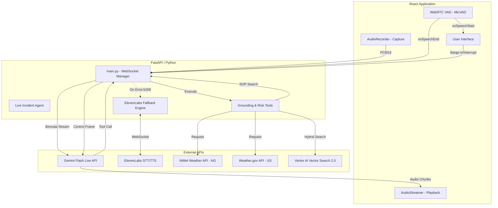

# RAVEN Architecture Overview

The following diagram illustrates the flow of data between the User Interface, the Backend (FastAPI), the Gemini Live API, and the Fallback engine (ElevenLabs).

### Component Details
- **WebRTC VAD (`@ricky0123/vad-web`)**: Runs client-side for low-latency speech detection. Triggers barge-ins locally and sends "speech end" signals to finalize transactions.
- **FastAPI WebSocket**: Acts as the central hub. Routes audio to/from Gemini and handles tool execution.
- **Support Tools**:
    - **Grounding Tools**: Bridges the agent to real-world weather data.
    - **Risk Tools**: Classifies scene data into hazard levels.
    - **Vector Search 2.0**: Specialized hybrid search (Semantic + Lexical) for historical incident knowledge.
    - **SOP Catalog**: local `.json` database of safety procedures.
- **ElevenLabs Fallback**: Activated automatically if the primary Gemini stream encounters a policy violation (e.g., restricted content) or connection error.
