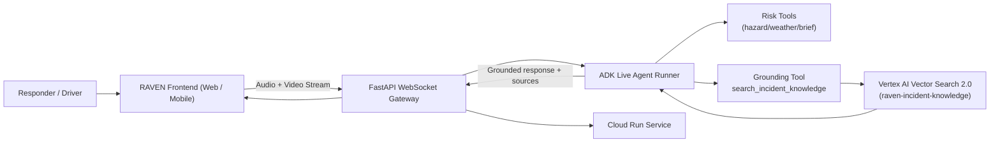

# RAVEN Submission Evidence Pack (Devpost Ready)

Use this file as your copy-paste source for the Devpost submission form and your final demo recording checklist.

Companion assets:

- `docs/voiceover_240s.md`
- `docs/devpost_submission_draft.md`
- `docs/recording_shot_list.md`

## 1. One-Paragraph Project Description (Copy/Paste)

RAVEN (Real-time Agent for Visual Emergency Navigation) is a multimodal live incident-response copilot built with Gemini Live + ADK and deployed on Google Cloud Run. It moves beyond text chat by allowing users to stream camera + microphone in real time, interrupt the agent naturally, and receive grounded safety guidance plus handoff-ready incident briefs. The project was inspired by a real storm collision on the Ekiti-Lagos corridor involving a trailer, a nine-seater bus, and multiple cars. To reduce hallucinations, RAVEN uses confidence-gated retrieval over a curated incident corpus in Vertex AI Vector Search 2.0 with source-quality ranking and abstention behavior for low-confidence or legal-overreach prompts.

## 2. What We Built (Copy/Paste)

- Live voice + vision incident assistant (camera + mic over bidirectional WebSocket)
- ADK-based live agent with tool calling for hazard detection, grounding, and incident brief generation
- Confidence-gated grounding tool (`search_incident_knowledge`) backed by Vertex AI Vector Search 2.0
- Source-quality ranking and explicit abstain/clarify behavior for unsafe or low-confidence queries
- Cloud-native backend deployment on Google Cloud Run
- Frontend operations console for timeline, sources, risk panel, and incident brief

## 3. Architecture (Copy/Paste)



## 4. Google Cloud Deployment Proof Checklist

Record a short clip (30-60 seconds) showing all of the following:

1. Cloud Run service page with latest revision healthy
2. Live request logs while using the app
3. Environment variables showing project/region setup
4. Vector Search collection existing (`raven-incident-knowledge`)
5. A successful ingestion run and eval run in terminal

### Suggested proof commands

```bash
# from repo root
cd /Users/surfiniaburger/Desktop/way-back-home/raven-live-agent

# confirm API enabled
gcloud services list --enabled --project gem-creator | rg vectorsearch

# backend ingest
cd backend
set -a && source .env && set +a
.venv/bin/python scripts/ingest_vector_data.py --input data/sources/incident_knowledge.jsonl --batch-size 50

# eval
cd ..
set -a && source backend/.env && set +a
backend/.venv/bin/python backend/eval/eval_grounding.py
```

## 5. Grounding Eval Evidence (Copy/Paste)

Current grounding evaluation summary (`backend/eval/data/grounding_eval_report.json`):

- Total cases: 5
- Passed: 5
- Pass rate: 1.0
- Errors: 0
- Source coverage: 0.6
- Average confidence: 0.5823
- Mode distribution:
  - `grounded_answer_ok`: 3
  - `below_min_confidence`: 1
  - `ask_clarifying_or_abstain`: 1

Interpretation:
- In-domain operational prompts are grounded with sources.
- Out-of-scope / weak-context prompts are safely gated.
- Legal-overreach prompts trigger abstain/clarify behavior.

## 6. Data Story + Quality Positioning (Copy/Paste)

RAVEN starts with a synthetic but domain-aligned internal corpus derived from realistic highway storm incident patterns and first-response SOP style documents. The initial dataset is intentionally small for hackathon speed and evaluation transparency. The production plan is to expand to authoritative transport safety standards, emergency response playbooks, and jurisdiction-specific advisories with versioning, freshness checks, and source-quality scoring. This gives us a defensible path from demo reliability to startup-grade trust.

## 7. 4-Minute Narration Bullets (Copy/Paste)

- 0:00-0:20: Real incident origin story and problem statement (storm, multi-vehicle crash, need for live grounded guidance)
- 0:20-0:50: Start live session; show camera + mic + real-time streaming
- 0:50-1:45: Ask for risk assessment, interrupt mid-response, receive concise reprioritized actions
- 1:45-2:35: Trigger incident brief generation tool; show structured output in timeline
- 2:35-3:05: Ask grounded SOP question with sources, then ask legal-overreach question and show abstention
- 3:05-3:30: Show Cloud Run logs + architecture diagram + deployment proof
- 3:30-3:55: Startup path (fleet safety, emergency operations, insurance FNOL) and close

## 8. Devpost Submission Field Pack

### Built With

Gemini Live API, Google ADK, FastAPI, WebSocket, React, Vertex AI Vector Search 2.0, Google Cloud Run, Python, JavaScript

### Challenges We Ran Into

- SDK shape differences in Vector Search 2.0 requests/responses (`data_objects` vs `requests`, `score` vs `distance`)
- Cloud API enablement and ADC quota-project setup
- Retrieval filter format compatibility
- Balancing confident grounded answers with safe abstention behavior

### Accomplishments We’re Proud Of

- Real multimodal live interaction that breaks text-box UX
- Confidence-gated grounding with explicit source handling
- Cloud-native deployable architecture and reproducible ingest/eval pipeline
- A story-driven product thesis with clear startup path

### What We Learned

- Retrieval quality depends as much on schema/filter correctness as model quality
- Live agent UX must handle interruption and uncertainty gracefully
- Judges value proof: logs, architecture, and measurable eval behavior

### What’s Next for RAVEN

- Expand authoritative corpus and per-jurisdiction policy packs
- Add automated continuous ingestion + data quality monitoring
- Add stronger eval suites (scenario simulation + regression checks)
- Pilot with transport/fleet safety operators
