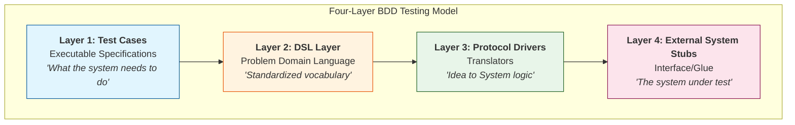

© Continuous Delivery Ltd. 2023
BETTER SOFTWARE FASTER
DAVE FARLEY’S HOW TO GUIDE
Introduction
None of us are born “great programmers” - great programmers are regular programmers with great
habits! As with any acquired skill, such as playing a musical instrument or studying a scientific discipline,
it takes commitment, a desire to explore, and creativity. The best way to get those things is tohave fun! So
what are the great habits of a great software developer?
Code As Communication
Be Cautious Of Frameworks
Adopt GREAT Developer Habits
We might think of the target of our code as the computer - in reality though, it is other people!
• Focus on writing code that communicates well to other people, make it easy to read, understand and learn
from. Often this person will be you, in the future!
• Great programmers spend time and effort in making their code clear and simple to understand, it should
communicate ideas effectively and concisely
Tips for Clearer Code:
◦ Pick clear descriptive names for modules, functions and variables. Pick names that allow you to make
little sentences that make sense.
◦ Keep each module and function small and focused on a single task. (Aim for functions of less than 5-10
lines)
◦ Aim to write code that anyone could read so they can understand what's happening in their narrow
focus in just a few seconds.
Modern software frameworks can be helpful, but there are downsides - they also impose a structure to
your code, This can mean your code might be forced to change when the framework does.
• A framework can impose an external structure on code that tends to lock you in, possibly preventing
you migrating to a different one - use with care!
• Maintain the freedom to change your code when you decide to. Think about the degree to which a
framework forces its programming model on you. Choose ones that ask less compromise from your
code.
• Ask: how much of my code is tailored to reflect the framework specifics?
•Try to isolate any third-party code behind your own abstraction of its functions. This leaves you with
greater choice if you wish to change your mind in the future.
“Ask not what you can do for your framework, ask what your framework can do for you!” 
© Continuous Delivery Ltd. 2023
BETTER SOFTWARE FASTER
DAVE FARLEY’S HOW TO GUIDE
Coding Is Design
Quality Over Features
Don’t get bogged down by tools and technology! Think instead about how your system really works? It
is the shapes of the solutions that really matter.
• Focus first and foremost on the information you are dealing with and how it is exchanged between
different parts of your system.
• Focus on managing the complexity of your system.
• Systems with low complexity are systems of good design!
• Good design in software is measured by how easy it is to change!.
Managing Complexity!
At every level aim for simplicity and prefer design choices that maximise:
• Modularity
• Cohesion
• Separation of Concerns
• Abstraction
• Reduce Coupling
“Good design, not tool use, distinguishes the great developers from the not so great.”
Great programmers take pride in the quality of the features they build. Focusing only on feature
production ends up being slower, and producing fewer features, not more.
• Aim to retain and sustain your ability to make changes effectively and efficiently indefinitely.
• Adopt incremental approaches like Continuous Delivery and Agile development.
• Optimise for the long haul by building high quality now that will reduce rework in the future.
Imagine yourself revisiting your code in the future - will it still make sense to you then? If not, refactor
until it will.
The best programmers make progress in small steps, checking each step as they go.
• Use Test Driven Development - make a small change then check that the tests still pass!
• Learn how to and get proficient at refactoring code, again make small changes and after each tiny
step.
Working in small steps is one of the most important ideas in doing a better job in software development.
By doing so we are optimising to get faster higher-quality feedback. By progressing in small steps, we
learn more quickly, proceed with more confidence, are better able to explore our solutions, and
continually judge, refine and improve them.
Work In Small Steps
© Continuous Delivery Ltd. 2023
BETTER SOFTWARE FASTER
DAVE FARLEY’S HOW TO GUIDE
Social Activity
Avoid Code Ownership
Great software developers talk to other people more often - and the best ones are great communicators.
• Remember - most effective software development is carried out in teams.
• Learn how to express your ideas - from simple to complex - clearly. If code is all about
communication, and it is, then improving your communication skills can only help!
• Pair Programming will improve your communication skills, as both pupil and teacher by forcing you
to have conversations about code and to learn from others.
•If you are struggling with a solution or an idea, go and explain it to someone else. You’ll be amazed
how often you’ll solve the problem before you’ve even finished explaining it!
• Other ways to grow your communication skills: go out of your way to collaborate on unfamiliar tasks
with people at work, write a blog, join a user/meetup group or online discussion forum.
Software development does not thrive in a vacuum! Of course there will be times when working alone
allows you to concentrate on a problem but don’t over do it, and always remember to share your ideas.
Speaking of which…
Code is not yours! Great developers are free with their ideas and usually open to having them critiqued
and reviewed.
• Of course, defend your ideas vigorously, but also always be open to changing your mind when you
learn something new.
• Don’t be precious about “your” code - it’s not yours, it belongs to the team!
• Be happy when you find code that you can delete!
We want people to criticise our ideas to get new and different perspectives. While there may be one
person who knows a particular part of the system better, they should encourage, and support, others to
change it.
This may seem a lot to take in, and it may take a fair bit of effort to achieve… but everything worth
pursuing in life always does! Don’t fall for the narrative that someone is a “code guru” or “rockstar
programmer”. The greatest programmers are the ones who have written enough code to have made the
most mistakes, and have learned from them. Never be scared to make mistakes - learn, instead, to
embrace them!
“An expert is someone who knows some of the worst mistakes that can be made in his subject, and how
to avoid them.” - Werner Heisenberg
Conclusion
© Continuous Delivery Ltd. 2023
BETTER SOFTWARE FASTER
DAVE FARLEY’S HOW TO GUIDE
Books*
:
• The Pragmatic Programmer: your journey to mastery, 20th Anniversary Edition https://amzn.to/3EdXvBm
• Software Developers’ Guidebook - https://leanpub.com/softwaredevelopersguidebook or https://amzn.to/
4f9ozFK
Modern SW Engineering on YouTube, Videos:
• Don't Build Perfect Software https://youtu.be/NEJUkvWGuvw?si=FLzcGwaSzVILOhMf
• 5 Ways to Improve Your Code https://youtu.be/1KeJc6V4Jjk?si=eQS9rIT9awqdDlrt
• 5 Vital Tips For Junior Developers https://youtu.be/uN43mq_i4ko?si=MMbZp4_qXt0GcXQS
• How To Be A GREAT Programmer https://youtu.be/X99Be8wJBMI?si=wI7ybAGZcJ4j_sFk
•The Engineering Room Ep. 17 https://youtu.be/7FtNjeYKVAE?si=sic_AMX88n5MJGhu
Trainng by Dave Farley:
Continuous Delivery: Better Software Faster - https://courses.cd.training/courses/cd-better-sw-faster
*We use Amazon Affiliate links for books. If you use these links to buy a book, Continuous Delivery Ltd. will get a small fee for the
recommendation with NO increase in cost to you.
Further Learning, Reading & Viewing

This video provides an expert perspective on **Behavior-Driven Development (BDD)**. It explains how to structure testing code using a "four-layer approach" to make testing more effective, readable, and maintainable.

### Video Transcript

**(00:00) The Core Benefit of BDD**
"One of the big wins of BDD is that it makes the need to establish a language that describes the problems that we aim to fix more obvious. And if you want to make our specifications executable, it encourages us to regularize that language into an executable form and make it ubiquitous, so we use it everywhere."

**(00:20) Advice: Domain-Specific Languages (DSLs)**
"My advice is to grasp this opportunity with both hands and consciously work to make a domain-specific language that you can use to define scenarios that exercise your system and steer your development. Then use it to make writing and implementing BDD scenarios easy."

**(00:36) The Four-Layer Approach to Test Code**
"I confess that I prefer internal DSLs—DSLs built on top of my programming language for this job, but you can do this very effectively in Gherkin too. I think of this as a four-layer approach to your test code, which is equally applicable whether you're doing an internal DSL or an external DSL along the Gherkin kind of model."

**(00:56) The Four Layers**
*   **Layer 1: Test Cases (Executable Specifications):** "The test cases are focused on what the system needs to do."
*   **Layer 2: Domain-Specific Language (DSL):** "The DSL layer, defining that the language that is used in those test cases and providing some other helpful tools along the way."
*   **Layer 3: Protocol Drivers:** "The protocol drivers, which translate between ideas in the language of the problem domain (expressed in the DSL) and the system under test."
*   **Layer 4: External System Stubs:** "Gives us the glue between our tests and the system that we're evaluating."

***

### Mermaid Diagram for Workflow Exploration

This diagram visualizes the "Four-Layer Approach" to test code as described in the video. The layers progress from abstract requirements (top) to technical implementation (bottom).

